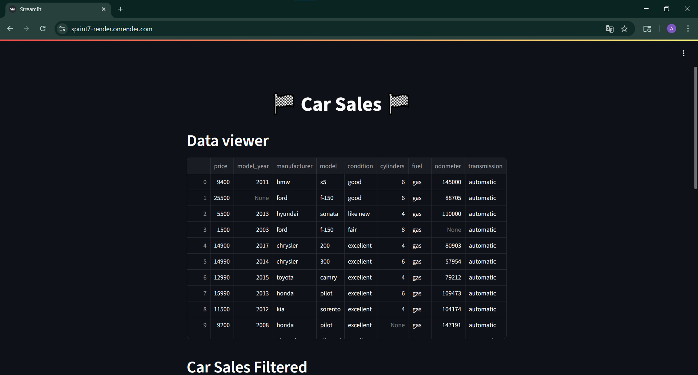
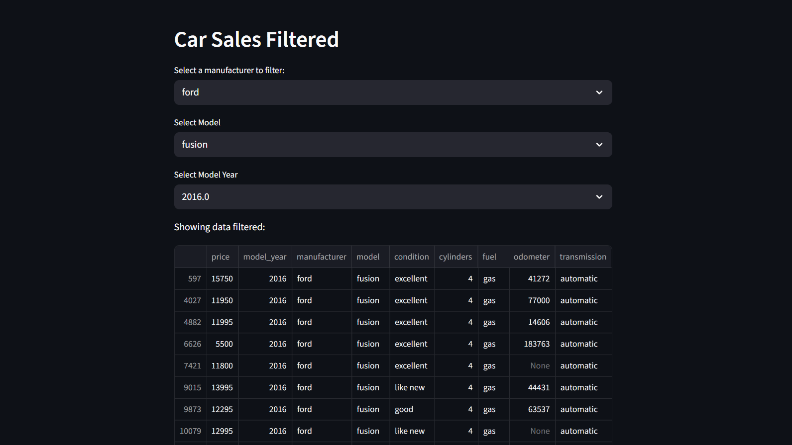
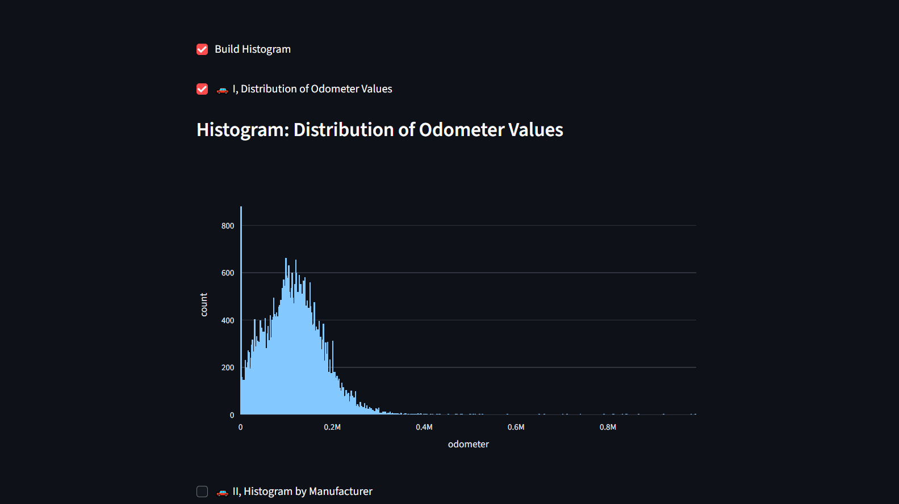
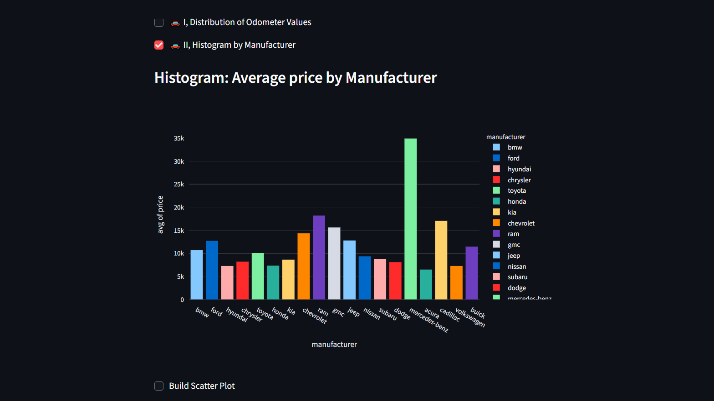
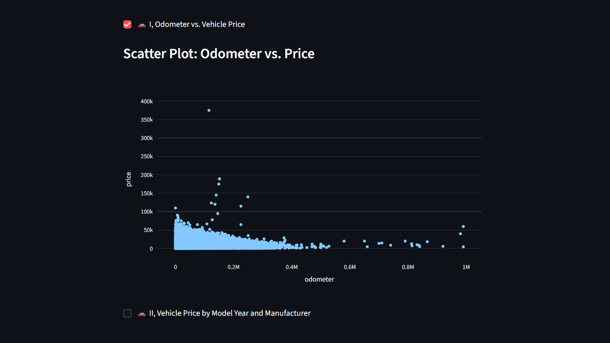
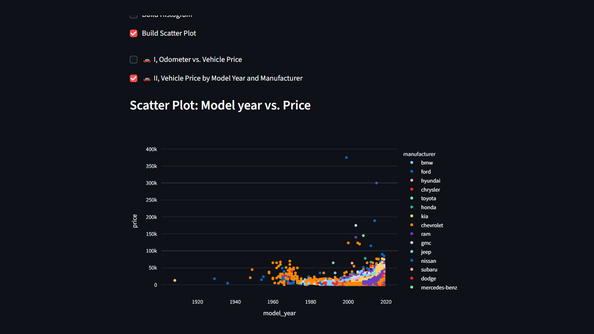

# Proyecto Sprint7

Este proyecto utiliza **Python**, **Streamlit**, **GitHub** y **Render** para analizar un conjunto de datos de anuncios de venta de automóviles.
###
El objetivo es construir y desplegar un panel de control web desarrollado inicialmente con VS Code, alojado públicamente en GitHub y deplegado en Render.
###
Con este proyecto, se busca aplicar y consolidar las habilidades adquiridas acerca de las herramientas y prácticas de desarrollo de software. 
#

#
## Funcionalidades del proyecto
- **`Funcionalidad 1:`** Ver dataset completo
- **`Funcionalidad 2:`** Filtrar dataset
    - Por fabricante
    - Por modelo
    - Por año del modelo

- **`Funcionalidad 3:`** Construir gráficos
    - **3.1. Histogramas**
        - 3.1.1. Distribucion de Valores de Odometro
        

        - 3.1.2. Promedio por Fabricante
        

    - **3.2. Gráfico de dispersión**
        - 3.2.1. Odometro vs. Precio
        

        - 3.2.2. Año del modelo vs. Precio
        

## Clonar el repositorio
`git clone https://github.com/andreavaraujor/Sprint7.git`
`cd Sprint7`

## Instalar dependencias
`pip install -r requirements.txt`

## Ejecución 
`streamlit run app.py`

## Demo en vivo
Puedes ver la aplicación desplegada aquí: [Mi app en Render](https://sprint7-render.onrender.com/)